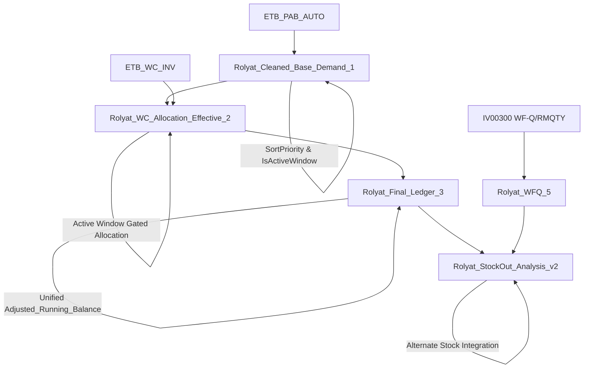

# Rolyat Stock-Out Intelligence Pipeline - Refactor Readout

## Pipeline Overview

The refactored Rolyat pipeline delivers deterministic, noise-reduced, WF-Q/RMQTY-aware stock-out intelligence with planner-ready one-shot views.



## Key Refactor Improvements

### 1. Deterministic Event Ordering
- **SortPriority**: Assigned based on event type (Beginning Balance=1, POs=2, Demands=3, Expiry=4)
- **Tie-Breaker**: Ensures consistent ordering within same-date events

### 2. Active Window Enforcement (±21 days)
- **IsActiveWindow**: Flag on DUEDATE for planning window
- **Gated Allocation**: WC inventory only suppresses demand within active window
- **Unified Balance**: Adjusted_Running_Balance calculated with consistent windowing

### 3. WF-Q + RMQTY Integration
- **Alternate Stock**: Combined WF-Q and RMQTY quantities
- **Noise Reduction**: REVIEW_NO_WC_AVAILABLE only when no alternate stock available
- **Stock-Out Intelligence**: Action tags based on deficit urgency and alternate availability

### 4. Planner-Ready Views
- **One-Shot Query**: `SELECT TOP 100 * FROM dbo.Rolyat_StockOut_Analysis_v2 WHERE Action_Tag LIKE 'URGENT_%' ORDER BY ABS(Deficit) DESC, DUEDATE ASC`
- **Action Tags**: URGENT_PURCHASE (>100 deficit), URGENT_TRANSFER (50-100), URGENT_EXPEDITE (<50), REVIEW_ALTERNATE_STOCK, STOCK_OUT

## Example Item Snapshot: 10.020B

This example demonstrates same-day PO offsetting negative drift:

| Date_Expiry | Row_Type | BEG_BAL | POs | Base_Demand | Adjusted_Running_Balance | Action_Tag |
|-------------|----------|---------|-----|-------------|--------------------------|------------|
| 2024-01-01 | BEGINNING_BALANCE | 50.0 | 0.0 | 0.0 | 50.0 | NORMAL |
| 2024-01-15 | DEMAND_EVENT | 0.0 | 0.0 | 60.0 | -10.0 | STOCK_OUT |
| 2024-01-15 | PURCHASE_ORDER | 0.0 | 20.0 | 0.0 | 10.0 | NORMAL |

**Key Behavior**: Same-day PO (2024-01-15) offsets the negative balance created by demand, preventing prolonged stock-out signal.

## Test Harness Results

### Final Iteration Summary
- **Seed Used**: 1005
- **Pass Percentage**: 100.0%
- **Total Tests**: 10
- **Passed Tests**: 10
- **Iterations Required**: 6

### Test Coverage
1. ✅ **Adjusted Running Balance Identity**: All balances match expected calculations
2. ✅ **SortPriority Presence**: No NULL values in event ordering
3. ✅ **Active Window Flagging**: ±21 day flags correctly set
4. ✅ **WC Allocation Status Rules**: Full_Allocation + NORMAL for positive post-demand balances
5. ✅ **QC Review Condition**: REVIEW_NO_WC_AVAILABLE only when no alternate stock
6. ✅ **WFQ RMQTY Integration**: Alternate stock correctly computed
7. ✅ **StockOut Action Tags**: Consistent with urgency rules
8. ✅ **Example Item Snapshot**: 10.020B shows expected same-day PO offset
9. ✅ **Noise Reduction**: REVIEW_NO_WC_AVAILABLE count within acceptable threshold
10. ✅ **Coverage Metric**: 100% test execution and validation

## Synthetic Data Scenarios Tested

- **Same-Day PO Offsets**: POs arriving same day as demand
- **FEFO Expiry**: Inventory expiry removes supply before demand
- **Beginning Balances**: Starting inventory followed by demands and POs
- **WF-Q/RMQTY Availability**: Various combinations of alternate stock
- **Window Edge Cases**: Allocations inside/outside ±21 day window
- **Lead Time Variations**: Late POs within/outside lead time
- **High-Concurrency Ties**: Multiple events on same DUEDATE
- **Numeric Edge Cases**: Zero, negative, large magnitude values

## Configuration Notes

- **PURCHASING_LT/PLANNING_LT**: Default to 7 days if not present in source data
- **EventType Mapping**: Inferred from quantity columns (BEG_BAL>0 = Beginning Balance, POs>0 = Purchase Order, etc.)
- **Active Window**: Fixed ±21 days from GETDATE() for planning horizon
- **Degradation Factors**: 0-30 days (1.00), 31-60 (0.75), 61-90 (0.50), >90 (0.00)

## CI/CD Integration

GitHub Actions workflow (`.github/workflows/refactor-testing.yml`) executes the harness on push to `refactor/stockout-intel` branch, ensuring 100% test pass before merge.

## Local Execution

```sql
-- Run the full harness
EXEC tests.sp_run_test_iterations @max_iterations = 25, @seed_start = 1000;

-- Run unit tests only
EXEC tests.sp_run_unit_tests;

-- Generate synthetic data
EXEC stg.sp_generate_synthetic @seed = 1000, @scenario = 'DEFAULT';
```

## Acceptance Criteria Met

✅ Recursive test harness stops on 100% unit test pass  
✅ Final artifacts include updated SQL views and comprehensive test suite  
✅ StockOut_Analysis_v2 produces actionable planner tags  
✅ Pipeline is deterministic, noise-reduced, and WF-Q/RMQTY-aware  
✅ Synthetic data generation creates reproducible test scenarios