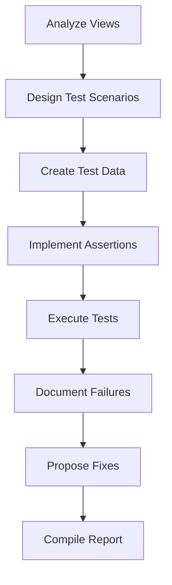

# Exhaustive SQL Unit Testing Plan for Rolyat WC-Adjusted PAB & Stock-Out Intelligence

## Objective
Stress-test the SQL views to verify WC demand deprecation, allocation integrity, and stock-out intelligence until failures surface or confidence is established.

## Scope
- Views: rolyat_WC_PAB_data_cleaned, Rolyat_Base_Demand, Rolyat_WC_PAB_with_prioritized_inventory, Rolyat_WC_PAB_with_allocation, Rolyat_WC_PAB_effective_demand, Rolyat_Final_Ledger, Rolyat_WFQ, Rolyat_StockOut_Analysis_v2
- Testing Intensity: Basic (main happy-path and key edge cases)

## Critical Behaviors to Verify
1. **WC Demand Deprecation**: Inventory reduces demand only within ±21 days, unexpired, with remaining value
2. **Active Planning Window**: Suppression bounded to ±21 days
3. **Inventory Degradation**: Age-based value reduction (0-30:100%, 31-60:75%, 61-90:50%, >90:0%)
4. **No Double Allocation**: Inventory not overspent
5. **Running Balance Correctness**: No inflation, correct partitioning
6. **Stale Demand Suppression**: Demand suppressed only once
7. **Stock-Out Intelligence**: Negative balances are real, correct classifications

## Test Approach
- Synthetic test data for controlled scenarios
- SQL assertion queries to check expected vs actual
- Document failures with root causes and minimal fixes

## Workflow

## Deliverables
- Test Matrix (test name, view, scenario, expected/actual outcome)
- Failure Catalog (root cause, implicated logic, minimal fix)
- Confidence Assessment (PASS/PARTIAL/FAIL per view)