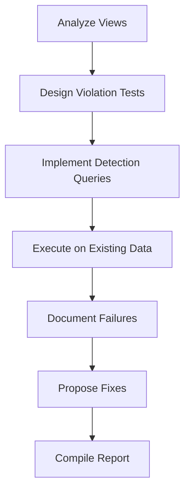

# Exhaustive SQL Unit Testing Plan for Rolyat WC-Adjusted PAB & Stock-Out Intelligence

## Objective
Stress-test the SQL views to verify WC demand deprecation, allocation integrity, and stock-out intelligence until failures surface or confidence is established.

## Scope
- Views: 5 numbered SELECT statements - Rolyat_Cleaned_Base_Demand_1.sql, Rolyat_WC_Allocation_Effective_Demand_2.sql, Rolyat_Final_Ledger_3.sql, Rolyat_Unit_Price_4.sql, Rolyat_WFQ_5.sql
- Testing Intensity: Basic (violation detection on existing data using inlined SELECT statements)

## Critical Behaviors to Verify
1. **WC Demand Deprecation**: Inventory reduces demand only within ±21 days, unexpired, with remaining value
2. **Active Planning Window**: Suppression bounded to ±21 days
3. **Inventory Degradation**: Age-based value reduction (0-30:100%, 31-60:75%, 61-90:50%, >90:0%)
4. **No Double Allocation**: Inventory not overspent
5. **Running Balance Correctness**: No inflation, correct partitioning
6. **Stale Demand Suppression**: Demand suppressed only once
7. **Stock-Out Intelligence**: Negative balances are real, correct classifications

## Test Approach
- Violation-detection queries on existing production data
- Queries return rows that violate expected behaviors
- No synthetic data insertion
- Document failures with root causes and minimal fixes

## Workflow

## Deliverables
- Test Matrix (test name, view, violations found, pass/fail)
- Failure Catalog (root cause, implicated logic, minimal fix)
- Confidence Assessment (PASS/PARTIAL/FAIL per view)